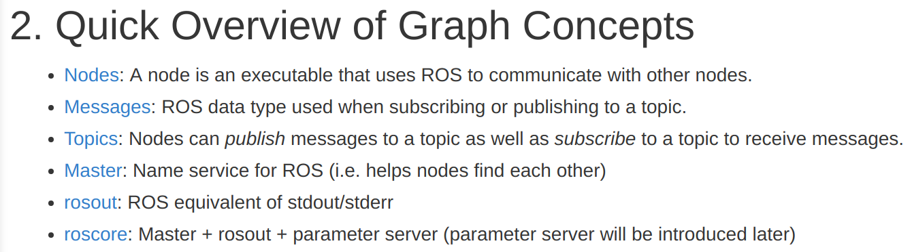

# ROS Commands

This directory is intended to help with different commands within ros. For specific commands, cd into the desired command. There will be images, txt files, and anything else that may be useful if you need help. In addition, there is help on our google drive in the folder labeled "ROS."

---

### Additional techniques if you find yourself still stuck:
1. ASK FOR HELP!!!

2. Try `<command> --help` or `<command> -h`

   * These two commands typically are useful if you do not know a flag or don't know a command
   * **Ex:** `rosrun --help`

3. Go onto ros.org and search for your specific command. Most commands are explained in a thorough and straight forward way.

If you learn additional commands, please insert them into the table at the bottom of the specified README.md.

-------------------------------
Generally, commands can be used to work with the following concepts (taken from the [ROS tutorials wiki](http://wiki.ros.org/ROS/Tutorials/UnderstandingNodes)):

To learn more about any of them consult the ROS wiki!
